# 阿里云中国区环境安装OpenShift 4.10 发行候选版的详细说明


## 关键字

| IPI  | OpenShift 4.10 | 阿里云中国区 | amd64 | CCO手工模式 |
| :--: | :-----------: | :-------: | :--: | :-------: |


2022年3月份，红帽的OpenShift 4.10版本将GA。新版本的一个重量级功能将是支持在阿里云的IPI（Installer-provisioned Infrastructure）安装方式。这会给广大阿里云的OpenShift用户，尤其是中国用户带来和国外亚马逊云科技、微软Azure相同的便利安装和使用体验。近日，我们在阿里云中国张家口区成功地进行了RC版安装测试。此次运用安装器以IPI方式安装，所有的集群资源除云凭证外均自动生成，操作过程非常简便。


## 特性介绍

阿里云和红帽的技术团队紧密协作，在新版本的OpenShift添加了以下几个方面相关特性：

- Alibaba Disk CSI Driver + Operator
- Alibaba Cloud Credential Operator
- Alibaba Machine API Provider
- Alibaba Cloud Controller Manager
- Alibaba 内部 OCP 镜像仓库对象存储

总体架构和基于裸金属安装方式类似，在集群创建过程中或之后，可以配置公共或私有网络连接。本次安装验证通过互联网络访问的集群。

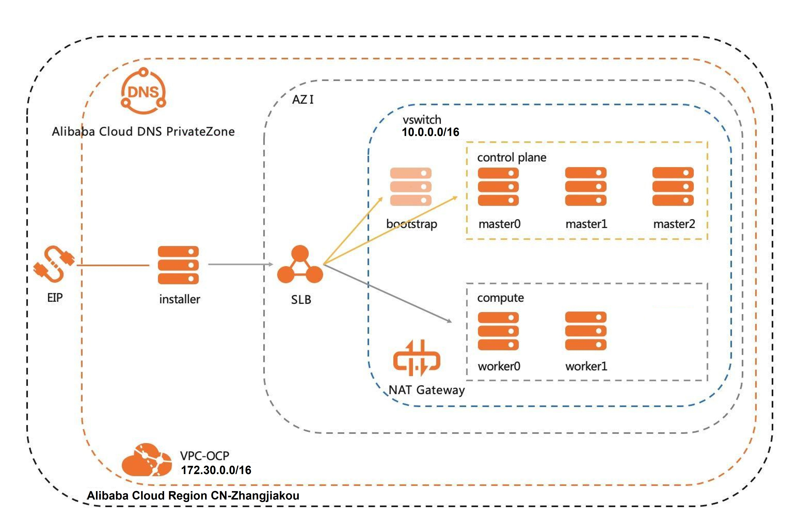

## 依赖条件

- 一个预先配置好的阿里云账户。本账户不会用于集群安装，在安装前需要用此账户创建CCO（Cloud Credential Operator）手工模式的RAM用户，用于满足操作用户的权限要求。

- 红帽账户，如没有可通过<u>参考链接1</u>免费申请。

- 若需要通过公共网络访问集群，还需准备好做了ICP备案的合规域名。


**注意：** 如果没有特别说明，以下的所有准备工作和安装步骤命令都在操作终端上执行。


## 准备工作

### 准备操作终端

需要准备一台操作终端，目前只能通过Linux或MacOS环境执行安装步骤。我们可以使用笔记本或本地虚拟机，确保能够正常上外网。也可以是阿里云的虚拟机，来通过同一虚拟网络进行安装。

### 获取安装命令行工具

我们用红帽账户登录<u>参考链接2</u>，点击 “ Download pull secret ” 来下载Pull Secret json文件。

定义PULL_SECRET和CURRENT_RELEASE变量来设置secret路径和OpenShift版本，然后下载相应的命令行工具。

```shell
export CURRENT_RELEASE="quay.io/openshift-release-dev/ocp-release:4.10.0-rc.1-x86_64"
export PULL_SECRET=alicloud/ocp4.10/pull_secret.json
oc adm release extract -a ${PULL_SECRET} --tools ${CURRENT_RELEASE}
```

将下载的工具包解压。

```shell
for cli_file in $(ls openshift-*.tar.gz); do tar xvfz "${cli_file}"; done

ll
-rwxr-xr-x 2 samm samm 122834568 Jan 31 18:37 kubectl
-rwxr-xr-x 2 samm samm 122834568 Jan 31 18:37 oc
-rwxr-xr-x 1 samm samm  49533443 Jan 31 18:37 openshift-client-linux-4.10.0-rc.1.tar.gz
-rwxr-xr-x 1 samm samm 619565056 Jan 31 18:14 openshift-install
-rwxr-xr-x 1 samm samm 130496126 Jan 31 18:14 openshift-install-linux-4.10.0-rc.1.tar.gz
-rw-r--r-- 1 samm samm       706 Jan 31 18:14 README.md
-rw-r--r-- 1 samm samm     28091 Feb  5 10:00 release.txt
-rw-r--r-- 1 samm samm       295 Feb  5 10:00 sha256sum.txt
```

获取CCO镜像标签来定义CCO_IMAGE变量，以及ALIBABA_REGION_ID变量来设置张家口或其它阿里云可用区域。

```shell
export CCO_IMAGE=$(./oc adm -a ${PULL_SECRET} release info --image-for='cloud-credential-operator' ${CURRENT_RELEASE})
echo $CCO_IMAGE
quay.io/openshift-release-dev/ocp-v4.0-art-dev@sha256:b717389e477ad2cf29d94deb80492ca4f4460e4a3e88b30aa378d0c929773770
export ALIBABA_REGION_ID="cn-zhangjiakou"
```

下载ccoctl命令行工具。

```shell
oc image extract ${CCO_IMAGE} --file="/usr/bin/ccoctl" -a ${PULL_SECRET}
chmod u+x ccoctl
./ccoctl alibabacloud -h
Creating/deleting cloud credentials objects for alibaba cloud

Usage:
  ccoctl alibabacloud [command]

Available Commands:
  create-ram-users Create RAM Users and policies
  delete-ram-users Detach RAM Policy from existing user

Flags:
  -h, --help   help for alibabacloud

Use "ccoctl alibabacloud [command] --help" for more information about a command.
```

### 生成登录密钥

```shell
ssh-keygen -t rsa -b 4096 -N '' -f ~/.ssh/id_rsa
```


### 准备配置文件

#### 生成安装配置文件

选择alibaba平台，按照提示依次填写Region、Base Domain（基础域名）、Cluster Name（集群名）、Pull Secret。其中Region参数可以选中国区域，比如张家口。如果基础域名是rhtsec.com，集群名是ocp410，那么集群访问URL中的域名将是以ocp410.rhtsec.com作为主域名。

```shell
mkdir install-dir
./openshift-install create install-config --dir install-dir
? SSH Public Key /home/samm/.ssh/id_rsa.pub
? Platform alibabacloud
? Region cn-zhangjiakou
? Base Domain rhtsec.com
? Cluster Name ocp410
? Pull Secret [? for help] ************************************************************************************************************************************************************************************************************************************************************************************************************************************************************************************************************************************************************************************************************************************************************************************************************************************************************************************************************************************************************************************************************************************************************************************************************************************************************************************************************************************************************************************************************************************************************************************************************************************************************************************************************************************************************************************************************************************************************************************************************************************************************************************************************************************************************************************************************************************************************************************************************************************************************************************************************************************************************************************************************************************************************************************************************************************************************************************************************************************************************************************************************************************************************************************************************************************************************************************************************************************************************************************************************************************************************************************************************************************************************************************************
INFO Install-Config created in: install-dir              
```

在install-dir目录下会生成配置文件install-config.yaml。

### 修改安装配置文件

修改配置文件中的如下yaml片段，增加credentialsMode: Manual配置；修改worker节点为2（表示安装将生成两个worker），默认为3。

```shell
vim install-dir/install-config.yaml

...
publish: External
credentialsMode: Manual
pullSecret: 
...
```

#### 生成manifests配置文件

```shell
./openshift-install create manifests --log-level debug --dir install-dir
```

#### 从发布中提取CredentialRequests

提取配置文件，确保存放到cco-credrequests目录下。

```shell
./oc adm release extract -a "${PULL_SECRET}" --credentials-requests --cloud=alibabacloud --to="cco-credrequests" "${CURRENT_RELEASE}"

tree cco-credrequests
cco-credrequests/
├── 0000_30_machine-api-operator_00_credentials-request.yaml
├── 0000_50_cluster-image-registry-operator_01-registry-credentials-request-alibaba.yaml
├── 0000_50_cluster-ingress-operator_00-ingress-credentials-request.yaml
└── 0000_50_cluster-storage-operator_03_credentials_request_alibaba.yaml
```

#### 从CredentialRequests创建RAM用户

创建RAM用户，用新manifests配置覆盖原始manifests。

```shell
./ccoctl alibabacloud create-ram-users --region ${ALIBABA_REGION_ID} --name $(awk '/infrastructureName:/{print $2}' install-dir/manifests/cluster-infrastructure-02-config.yml) --credentials-requests-dir cco-credrequests --output-dir cco-manifests
cp -v cco-manifests/*/*.yaml install-dir/manifests/
```

## 安装集群

### 安装过程

安装是全自动化的。以下是从开始安装到完成的命令行输出片段，最后几行提示了使用oc命令行以及浏览器登录集群的方法，以及默认用户口令等信息。

```shell
openshift-install create cluster --dir=install-dir --log-level=debug
......
time="2022-02-07T00:19:30+08:00" level=info msg="Waiting up to 40m0s (until 12:59AM) for the cluster at https://api.ocp410.rhtsec.com:6443 to initialize..."
time="2022-02-07T00:19:30+08:00" level=debug msg="Still waiting for the cluster to initialize: Working towards 4.10.0-rc.1: 662 of 770 done (85% complete)"
time="2022-02-07T00:24:01+08:00" level=debug msg="Still waiting for the cluster to initialize: Working towards 4.10.0-rc.1: 662 of 770 done (85% complete)"
time="2022-02-07T00:26:23+08:00" level=debug msg="Still waiting for the cluster to initialize: Working towards 4.10.0-rc.1"
time="2022-02-07T00:26:23+08:00" level=debug msg="Still waiting for the cluster to initialize: Working towards 4.10.0-rc.1: downloading update"
time="2022-02-07T00:26:24+08:00" level=debug msg="Still waiting for the cluster to initialize: Working towards 4.10.0-rc.1"
time="2022-02-07T00:26:24+08:00" level=debug msg="Still waiting for the cluster to initialize: Working towards 4.10.0-rc.1: 2 of 770 done (0% complete)"
time="2022-02-07T00:26:24+08:00" level=debug msg="Still waiting for the cluster to initialize: Working towards 4.10.0-rc.1: 69 of 770 done (8% complete)"
time="2022-02-07T00:26:39+08:00" level=debug msg="Still waiting for the cluster to initialize: Working towards 4.10.0-rc.1: 587 of 770 done (76% complete)"
time="2022-02-07T00:26:39+08:00" level=debug msg="Still waiting for the cluster to initialize: Working towards 4.10.0-rc.1: 588 of 770 done (76% complete)"
time="2022-02-07T00:26:54+08:00" level=debug msg="Still waiting for the cluster to initialize: Working towards 4.10.0-rc.1: 748 of 770 done (97% complete)"
time="2022-02-07T00:28:25+08:00" level=debug msg="Still waiting for the cluster to initialize: Working towards 4.10.0-rc.1: 748 of 770 done (97% complete)"
time="2022-02-07T00:28:39+08:00" level=debug msg="Still waiting for the cluster to initialize: Some cluster operators are still updating: authentication, console, monitoring"
time="2022-02-07T00:29:09+08:00" level=debug msg="Still waiting for the cluster to initialize: Working towards 4.10.0-rc.1: 763 of 770 done (99% complete)"
time="2022-02-07T00:30:54+08:00" level=debug msg="Still waiting for the cluster to initialize: Some cluster operators are still updating: authentication, monitoring"
time="2022-02-07T00:32:51+08:00" level=debug msg="Still waiting for the cluster to initialize: Some cluster operators are still updating: authentication, monitoring"
time="2022-02-07T00:33:09+08:00" level=debug msg="Cluster is initialized"
time="2022-02-07T00:33:09+08:00" level=info msg="Waiting up to 10m0s (until 12:43AM) for the openshift-console route to be created..."
time="2022-02-07T00:33:09+08:00" level=debug msg="Route found in openshift-console namespace: console"
time="2022-02-07T00:33:09+08:00" level=debug msg="OpenShift console route is admitted"
time="2022-02-07T00:33:09+08:00" level=info msg="Install complete!"
time="2022-02-07T00:33:09+08:00" level=info msg="To access the cluster as the system:admin user when using 'oc', run 'export KUBECONFIG=/home/samm/Share/CentOS7x64_ShareDir/PoC/alicloud/ocp4.10/ocp10/install-dir/auth/kubeconfig'"
time="2022-02-07T00:33:09+08:00" level=info msg="Access the OpenShift web-console here: https://console-openshift-console.apps.ocp410.rhtsec.com"
time="2022-02-07T00:33:09+08:00" level=info msg="Login to the console with user: \"kubeadmin\", and password: \"xxxxxxxxxxxxxxxxxxxxxx\""
time="2022-02-07T00:33:09+08:00" level=debug msg="Time elapsed per stage:"
time="2022-02-07T00:33:09+08:00" level=debug msg="           cluster: 1m40s"
time="2022-02-07T00:33:09+08:00" level=debug msg="         bootstrap: 36s"
time="2022-02-07T00:33:09+08:00" level=debug msg="Bootstrap Complete: 14m55s"
time="2022-02-07T00:33:09+08:00" level=debug msg="               API: 3m42s"
time="2022-02-07T00:33:09+08:00" level=debug msg=" Bootstrap Destroy: 23s"
time="2022-02-07T00:33:09+08:00" level=debug msg=" Cluster Operators: 13m38s"
time="2022-02-07T00:33:09+08:00" level=info msg="Time elapsed: 31m17s"
```

可以观察到总的安装时长约为30分钟左右。

### 安装观察

登录阿里云控制台，可以看到三个master和两个worker节点均匀分散在张家口区域中的三个可用区。

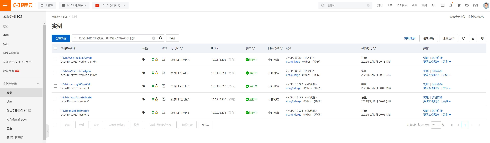

集群专用资源组以及OpenShift相关的资源被安装器创建出来。

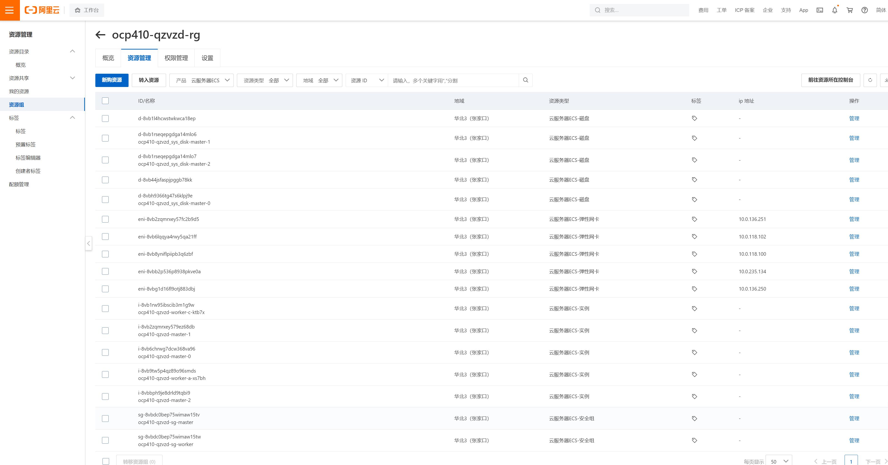

### 集群检查

将安装完成时提示的OpenShift控制台URL地址输入浏览器，用默认用户和口令登录和管理集群。

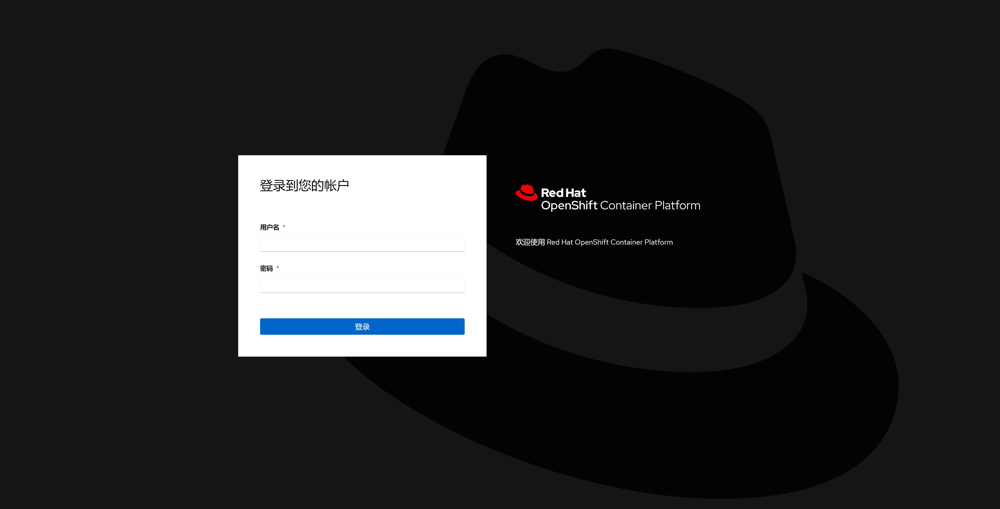

在计算->节点菜单中，我们可以看到集群节点列表，master的实例类型是ecs.g6.xlarge，worker的实例类型是ecs.g6.large。

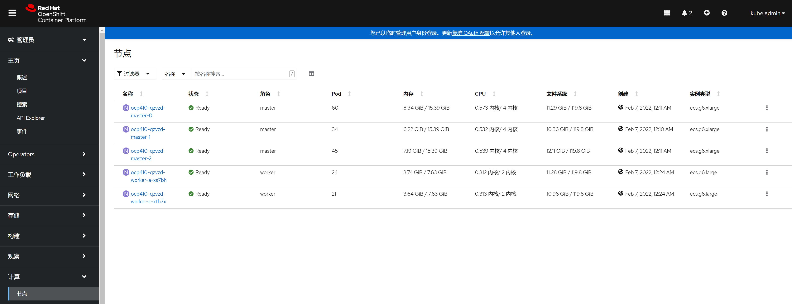

在计算->机器页面中，我们可以看到机器分布在不同的可用区。

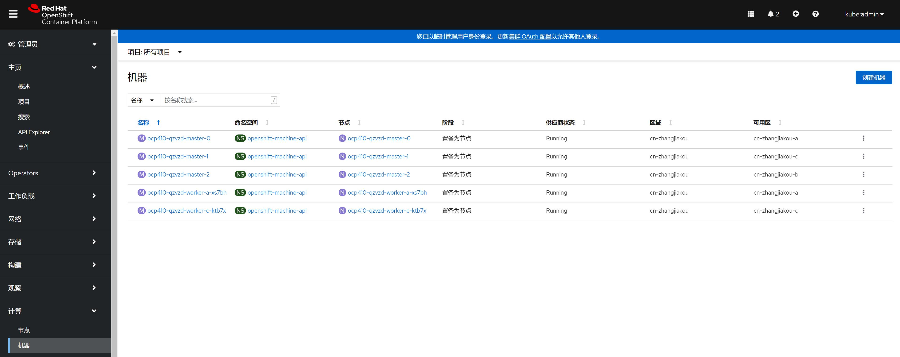

在管理->集群设置->集群Operator页面中，可以观察到所有的Operator都是Available状态。

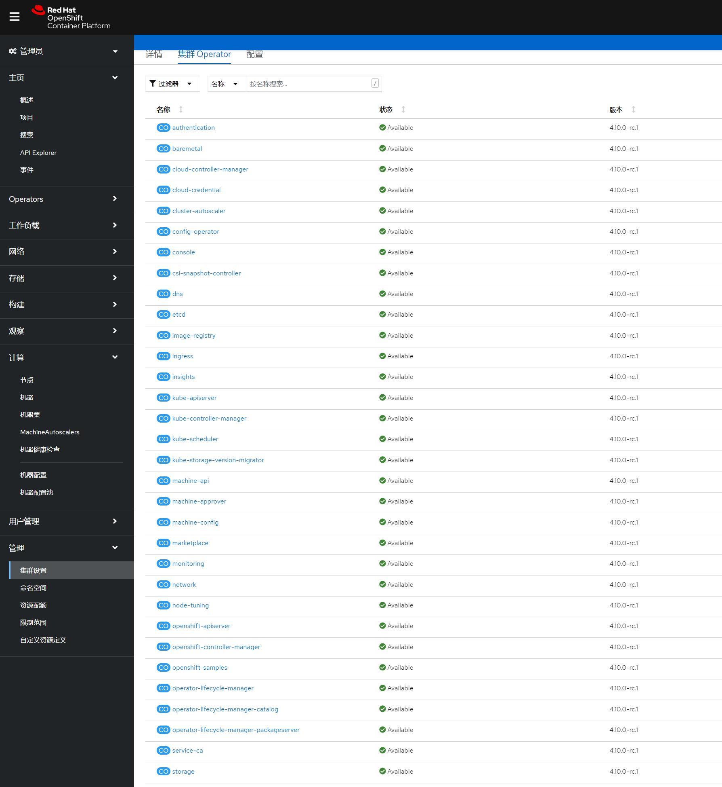

## 节点扩缩容验证

### 扩容

集群可以快速进行扩缩容，只需要在OpenShift控制台修改计算->机器集页面中相应可用区的机器集的Desired count（所需机器数量）。现在把b区数量由0改为1来增加一个节点。


我们在AWS控制台上，稍后就可以看到b区新的实例被创建起来了。

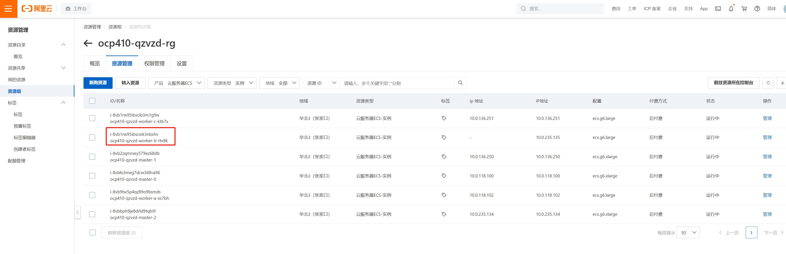

几分钟后，机器所处的阶段由Provisioned变为Provisioned as node（置备为节点），节点状态也变成Ready表明扩容完成。

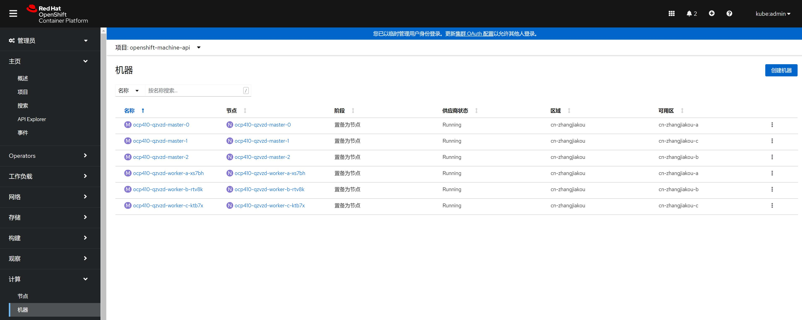

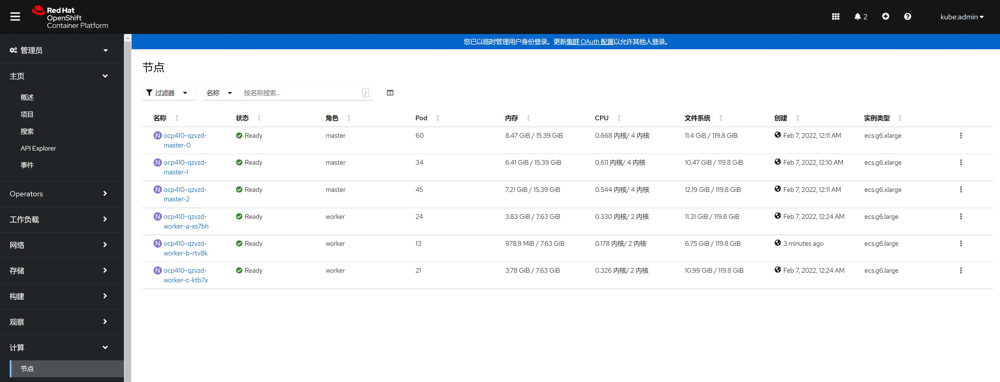

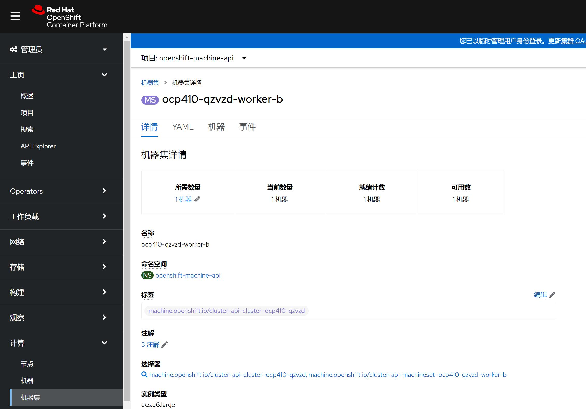

### 缩容

接下来，把b区数量由1改回为0来减少一个节点。即将被销毁的节点先会标记为调度被禁用，经过二三分钟，此节点就会被自动删除。


## 删除集群

所有的关联计算资源对象都会被自动清理掉。

```shell
./openshift-install destroy cluster --dir=install-dir --log-level=info
INFO OSS bucket deleted                            bucketName=ocp410-qzvzd-image-registry-cn-zhangjiakou-nyidxhsxkttpfgplxbs stage=OSS buckets
INFO OSS buckets deleted                           stage=OSS buckets
INFO ECS instances deleted                         stage=ECS instances
INFO RAM roles deleted                             stage=RAM roles
INFO SLB instances deleted                         stage=SLBs
INFO Private zones deleted                         stage=private zones
INFO Security groups deleted                       stage=ECS security groups
INFO NAT gateways deleted                          stage=Nat gateways
INFO EIPs deleted                                  stage=EIPs
INFO VSwitches deleted                             stage=VSwitchs
INFO VPCs deleted                                  stage=VPCs
INFO Resource group deleted                        name=ocp410-qzvzd-rg stage=resource groups
INFO Time elapsed: 1m42s
```

## 总结
以上为4.10发行候选版在阿里云的IPI安装过程，希望能帮助感兴趣的朋友先行做个了解和体验。由于正式GA将在3月，目前功能、兼容性测试和缺陷修复还在进行，最终的操作步骤将以正式版的官方手册为准。

## 参考链接

1. 红帽账户免费申请网址：https://developers.redhat.com/
2. OpenShift资源下载网址：https://console.redhat.com/openshift/install/platform-agnostic
